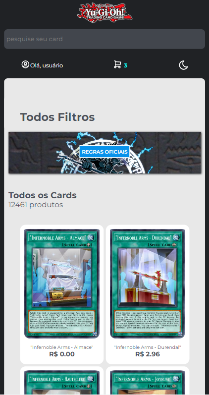
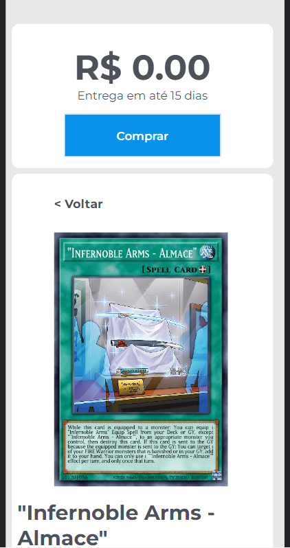
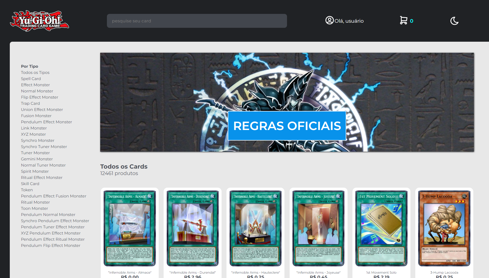
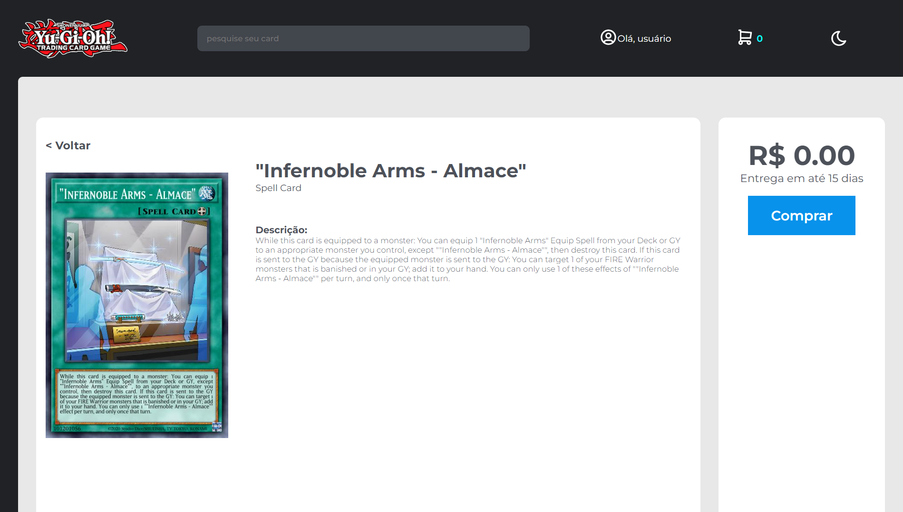
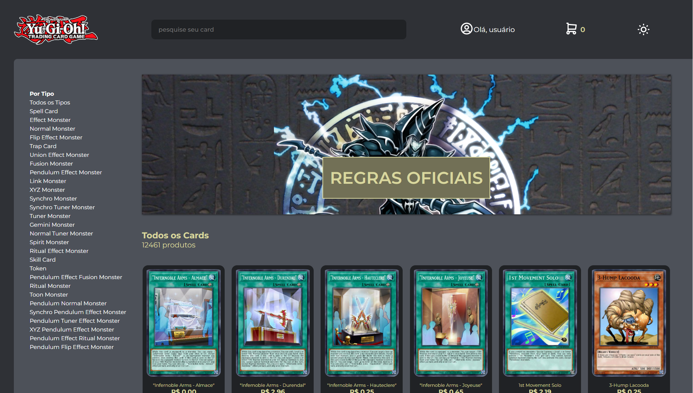
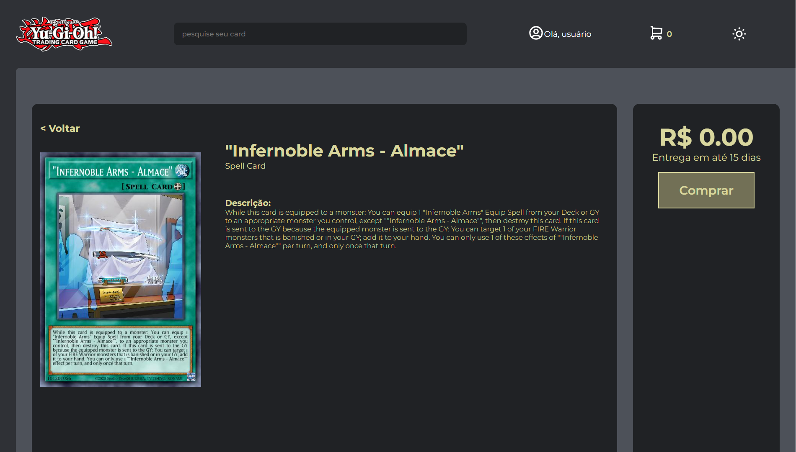

## 📖 Introdução

Yu-gi-oh Shop Card é uma aplicação web de um e-commerce com vendas de Cards de Yugioh, consumindo a API [YGOPRODeck](https://ygoprodeck.com/api-guide/), que possui mais de 12.000 informações detalhadas de todos os cards do jogo.

[Neste link](https://www.youtube.com/embed/KLZnIpEWjus), apresento uma introdução sobre o projeto.

## 🔗Link de Acesso
- Deploy Vercel: [clique aqui!](https://yu-gi-oh-shop-card.vercel.app/).
- Backend: Em breve

## 👥Equipe
| [<br><sub>Daniel Emidio</sub>](https://github.com/DanielEmidio1988) |
| :---: |

## 🧭Status do Projeto
- ⏳Em andamento: Back-End

## 📄 Concepção do Projeto

### Instalando
```bash
# Instalando dependências
npm install

# executando o projeto
npm start
```

### Layout Mobile

| <br><sub>Home Page</sub> | <br><sub>Detalhes</sub> |
| :---: | :---: |

### Layout Desktop

| <br><sub>Home Page</sub> | <br><sub>Detalhes</sub> |
| :---: | :---: |

### Layout Destop *DarkMode

| <br><sub>Home Page</sub> | <br><sub>Detalhes</sub> |
| :---: | :---: |

### Funcionalidades
```bash
. Listagem: Ao abrir a aplicação, você será direcionado a página principal, com a listagem de todos os cards disponiveis, sendo renderizado 24 cards por página.
. Detalhe: Cada card possui informações detalhadas sobre seus atributos, efeitos, entre outros que podem ser acessiveis ao clicar sobre o Card que deseja visualizar. O mesmo recurso permite adicionar o produto ao carrinho.
. Carrinho: Na página de Carrinho, você poderá aumentar, diminuir ou remover a quantidade de itens no carrinho. Com o cupom 'DEV', você terá o desconto de R$ 25 para compras acima de R$ 50. Para compras acima de R$ 25, o frete é gratuito.
. Compra: Na página de Fechamento de Compra, você poderá finalizar a compra e o carrinho e o pedido de compras serão finalizados. 
. DarkMode: função localizada no cabeçalho para alternar o tema da aplicação DarkMode ON/OFF;
. Responsividade: Aplicação totalmente responsiva para Desktop, Tablet e Celulares.
```

### Bibliotecas Utilizadas

```bash
styled-components
axios
react-router-dom
```

## 💡Programas utilizados:
- VSCode


## 💻 Tecnologias 


## 📫 Contato

E-mail: emidio.daniel@hotmail.com

[](https://www.linkedin.com/in/danielemidio1988/)
[](https://www.codewars.com/users/DanielEmidio1988)
